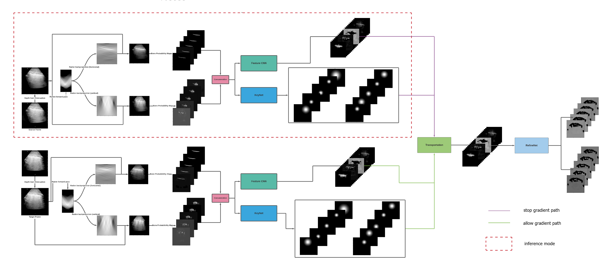

# US-Transporter-eval

This is the evaluation repository of Keypoint models trained on Lung and Wrist Ultrasound videos with work done additionally on the [outdated paper](https://arxiv.org/pdf/2106.05929.pdf "arXiv link")

# Setup  
```
git clone --recursive https://github.com/tripathiarpan20/US-Transporter-eval.git
cd US-Transporter-eval
pip install -r requirements.txt
mv phasepack/phasepack/* phasepack/
```

# Model Checkpoints

Run the following commands to download [LUS](https://drive.google.com/file/d/1HBuTOm_5-p7VrpYWYYPoJp2epQvbyPl9/view) and [WUS](https://drive.google.com/file/d/1TMMNh6Vp07ejBDInsar5wXhljs9q7T57/view) checkpoints respectively:

```
gdown --id 1HBuTOm_5-p7VrpYWYYPoJp2epQvbyPl9
gdown --id 1TMMNh6Vp07ejBDInsar5wXhljs9q7T57
```

# Evaluation

- [X] Separate scripts for LUS & WUS checkpoints using `pl_transporter.py` to take input as JPEG, PNG etc images and output keypoint marked images in an `output` folder to be prepared
  - [X] LUS
  - [X] WUS  

See `US_Transporter_eval.ipynb` for evaluation commands on Wrist and LUS Ultrasound images and videos.




